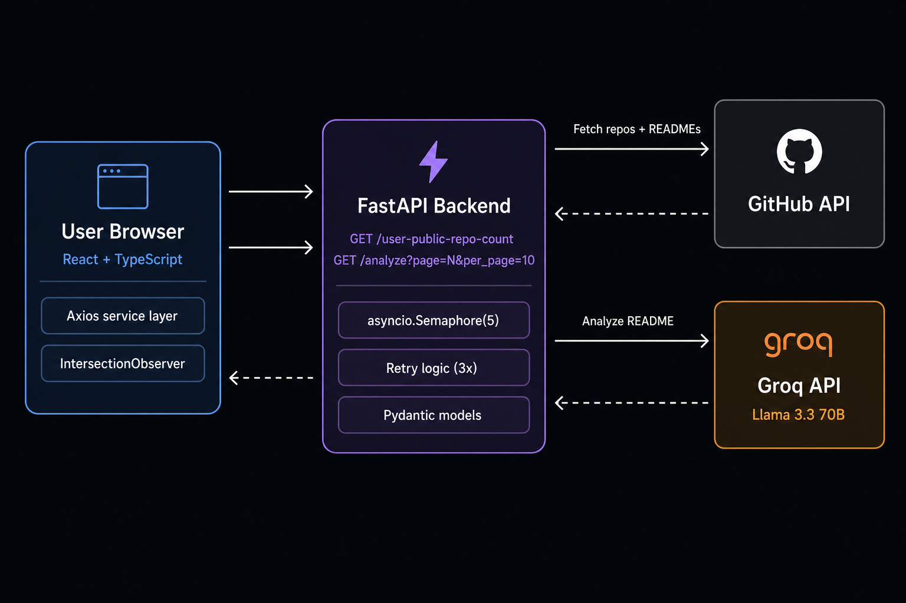

# GitHub Repo Analyzer

Analyze any GitHub user's public repositories using Groq (Llama 3.3 70B). Each repo is assessed as Basic, Intermediate, Advanced, or NA based on its README. Results load 10 at a time via infinite scroll.



## Setup

### Backend

```bash
cd backend
python3 -m venv .venv
source .venv/bin/activate
pip install -r requirements.txt
```

Create a `.env` file in the project root with your API keys:
```
GROQ_API_KEY=your_groq_key_here
GITHUB_TOKEN=your_github_token_here  # optional, raises GitHub rate limit from 60 to 5000 req/hr
CORS_ORIGIN=http://localhost:5173     # optional, defaults to http://localhost:5173
```

Get a free Groq API key at [console.groq.com](https://console.groq.com).  
Get a GitHub token (no scopes needed) at [github.com/settings/tokens](https://github.com/settings/tokens).

Run the backend:
```bash
uvicorn main:app --reload
```

The API will be available at `http://localhost:8000`.

### Frontend

```bash
cd frontend
npm install
npm run dev
```

Optionally, create `frontend/.env.local` to point at a different backend:
```
VITE_API_URL=http://localhost:8000
```

The app will be available at `http://localhost:5173`.

## Usage

1. Open `http://localhost:5173` in your browser.
2. Enter a GitHub username and click **Analyze**.
3. The first 10 repositories are fetched and analyzed immediately.
4. Scroll down to automatically load the next batch of 10.

## Levels

| Badge | Meaning |
|-------|---------|
| **Basic** | Beginner-friendly project, simple structure |
| **Intermediate** | Moderate complexity, some experience required |
| **Advanced** | High complexity, advanced concepts |
| **NA** | No README available — could not assess |

## API

### `GET /user-public-repo-count?username={github_username}`

Returns the total number of public repositories for the user as a plain integer.

---

### `GET /analyze?username={github_username}&page={page}&per_page={per_page}`

| Parameter | Default | Description |
|-----------|---------|-------------|
| `username` | required | GitHub username |
| `page` | `1` | Page number (1-based) |
| `per_page` | `10` | Results per page (max 100) |

Returns a list of analyzed repositories for the requested page:

```json
[
  {
    "repo_name": "my-project",
    "repo_url": "https://github.com/user/my-project",
    "level": "Intermediate",
    "summary": "This project is a REST API for managing todo items...",
    "has_readme": true
  }
]
```

**Error responses:**
- `404` — GitHub user not found
- `429` — GitHub API rate limit exceeded
- `502` — GitHub API unavailable

## Approach & Challenges

### Architecture
The backend is a FastAPI async application using `httpx.AsyncClient` for all GitHub API calls. A single shared client is created at startup via a lifespan context manager and reused across requests for efficiency. The frontend is a React + TypeScript SPA using an Axios service layer (`src/services/api.ts`) to keep API logic separate from UI components.

### AI Provider Switch
The original plan used Gemini 2.0 Flash, but the free tier daily quota (`limit: 0`) was exhausted quickly during development. The project was switched to Groq (Llama 3.3 70B), which has a more practical free tier for development use.

### Rate Limit Handling
The main challenge was Groq's free tier: 30 requests/minute and 12,000 tokens/minute. Analyzing a user with many repos fires multiple simultaneous AI calls which instantly hit the limit. This was addressed in layers:
1. **Semaphore** — limits concurrency to 5 simultaneous AI calls per request
2. **Retry with backoff** — rate-limited calls are retried up to 3 times with increasing delays before falling back to NA
3. **Infinite scroll pagination** — only 10 repos are analyzed per page load, naturally spreading API usage over time as the user scrolls

### Infinite Scroll
Pagination was implemented using the browser's `IntersectionObserver` API. A sentinel element is placed at the bottom of the results grid with a `rootMargin` of 300px, triggering the next page fetch before the user reaches the bottom — ensuring a seamless experience with no visible loading gap. The total repo count is fetched once upfront via a dedicated `/user-public-repo-count` endpoint (using GitHub's user profile API) to avoid over-fetching.

## Assumptions & Limitations

- **Repos sorted by last updated** — the most recently active repositories appear first.
- **README truncation** — README content is truncated to 3,000 characters before being sent to the AI to keep costs and latency low.
- **Public repos only** — private repositories are never fetched or analyzed.
- **No caching** — every analysis request hits the GitHub and Groq APIs fresh. Re-analyzing the same user makes new API calls.
- **NA for missing READMEs** — repos without a README cannot be assessed and receive an NA badge.
- **README-based assessment only** — the AI assesses complexity based solely on README content, not the actual code. Projects with sparse or missing READMEs may be rated lower than their true complexity warrants.
- **Rate limits** — the free Groq tier allows ~30 requests/minute. The backend retries rate-limited calls up to 3 times with increasing delays before falling back to NA.
- **Concurrency limited** — at most 5 repositories are analyzed simultaneously per request (via a semaphore) to avoid overwhelming the Groq API and protect the free tier key.
- **Paginated loading** — only 10 repos are analyzed per scroll page, further reducing burst API usage and protecting the free Groq key from exhaustion on large accounts.

## Future Improvements

- **Streaming results** — use Server-Sent Events to stream each repo's analysis back to the frontend as it completes, so cards appear one by one instead of waiting for the full batch. On the backend, FastAPI's `StreamingResponse` with an async generator would yield each result as soon as it's ready, eliminating the need to wait for the full `asyncio.gather` to resolve. 
- **Result caching** — cache analysis results per username/repo so repeat lookups don't re-call the AI API
- **Fork filtering** — optionally skip forked repositories since they rarely have original READMEs worth analyzing
- **Sort options** — allow sorting results by level, name, or last updated date
